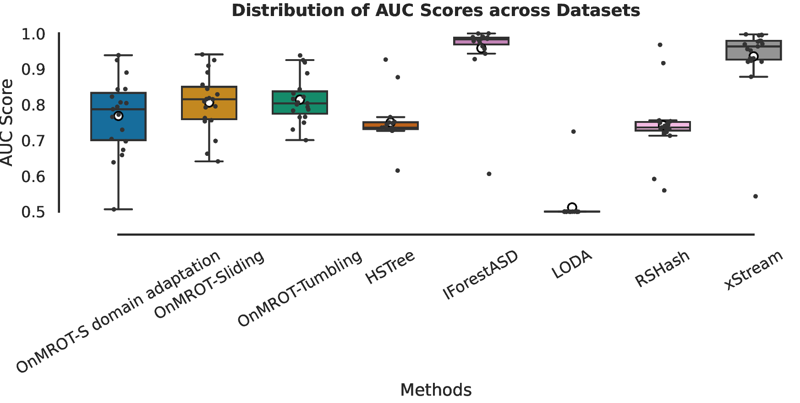
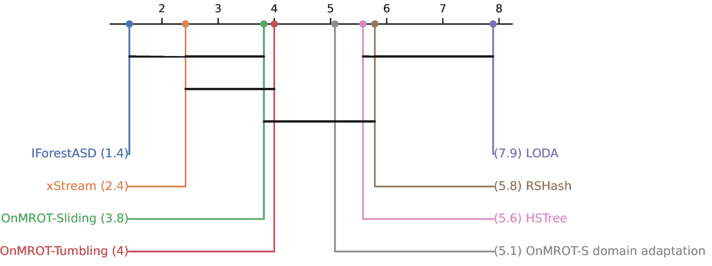

# OnMROT

**Unsupervised Online Anomaly Detection in Data Streams via Optimal Transport**

> A framework for detecting anomalies in non-stationary data streams through optimal transport.

---

## Overview

OnMROT addresses the challenge of anomaly detection in real-world data streams where the underlying distribution shifts over time. The system combines **Mass repulsive Optimal Transport (MROT)** with an online learning paradigm, enabling the model to adapt incrementally without full retraining.

Key features:
- Online domain adaptation to handle distribution shift in data streams
- Wasserstein distance-based alignment between source and target domains
- Anomaly-rate evaluation metrics
- Comparison against state-of-the-art (SOTA) baselines

---


## Getting Started

### Prerequisites

- Python 3.8+
- `pip` or `conda`
- (Optional) [DVC](https://dvc.org/) for dataset versioning

### Installation

1. Clone the repository:

```bash
git clone repository name
cd repository name
```

2. Install dependencies:

```bash
pip install -r requirements.txt
```

3. (Optional) Pull datasets via DVC:

```bash
dvc pull
```

---
> This work builds on top of **[MROT](https://github.com/eddardd/MROT)** codebase
## Datasets

Datasets are stored under `datasets/` and versioned with DVC.

This project uses the **SCAR** benchmark :


- **Original datasets**: [SCAR/original_data](https://github.com/yixiaoma666/SCAR/tree/master/original_data)
- **Generation configs**: [SCAR/generate_config](https://github.com/yixiaoma666/SCAR/tree/master/generate_config)

| Dataset | Path | Description |
|---|---|---|
| CAO2025 | `datasets/cao2025/` | Main benchmark dataset |
| Glass Shake | `datasets/files/glass_shake_sudden_2.csv` | Sudden drift example |

To generate datasets using SCAR configs, clone the SCAR repository and follow its instructions, then place the output files in `datasets/cao2025/new_dataset/`.

---

## Usage

### Running SOTA baselines

```bash
python run_sota.py
```

### Running the main experiment notebook

```bash
jupyter notebook experiments.ipynb
```

### Launching analysis notebooks

```bash
jupyter notebook
```

Available notebooks:

| Notebook | Description |
|---|---|
| `notebook/analyse` | Analyse results visualization |

---

## Core Modules

| Module | Description |
|---|---|
| `mrot.py` | Multi-source Robust Optimal Transport — core adaptation algorithm |
| `offline.py` | Batch processing pipeline for offline evaluation |
| `wasserstein.py` | Wasserstein distance computation |
| `onlineMROTrate_eval.py` | Online evaluation using anomaly rate metric |
| `utils.py` | Data loading, windowing, and shared helpers |

---

## Results

All outputs are saved automatically under `results/` with a timestamp:

```
results/
├── experiment_20260205_145501/
├── experiment_20260205_152112/
└── SOTA/
```

Each folder contains metrics (AUC, anomaly rate), To analyse the results, go to notebook folder




---


## Citation

If you use OnMROT in your research, please cite our paper:

```bibtex
@inproceedings{onmrot2026,
  title     = {Unsupervised Online Anomaly Detection in Data Streams via Optimal Transport},
  author    = {Tcheneghon Motcheyo, Herman and Falih, Issam and Mephu Nguifo, Engelbert},
  booktitle = {OWAD: Open World Anomaly Detection in Dynamic and Evolving Environments, IEEE International Conference on Data Mining Workshops (ICDMW)},
  year      = {2026}
}
```

---

## Acknowledgements

- [MROT](https://github.com/eddardd/MROT), the codebase this work builds upon.
- [SCAR](https://github.com/yixiaoma666/SCAR), the benchmark used for evaluation.
